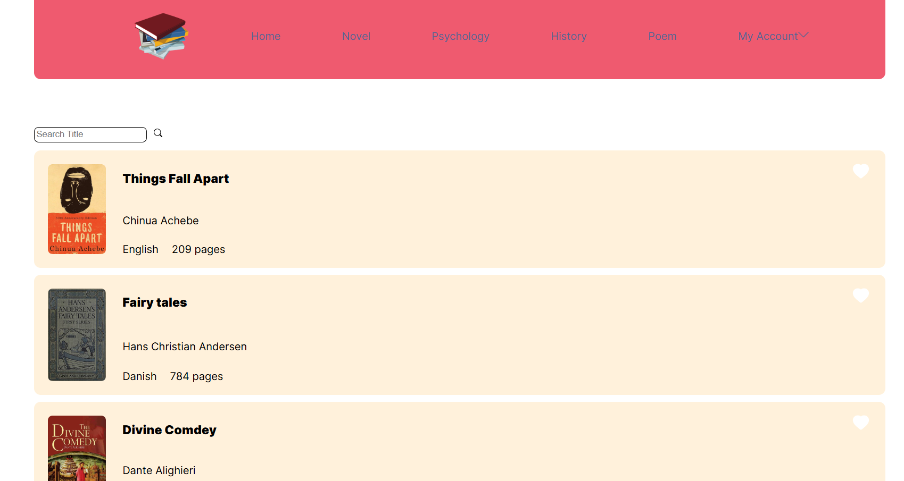
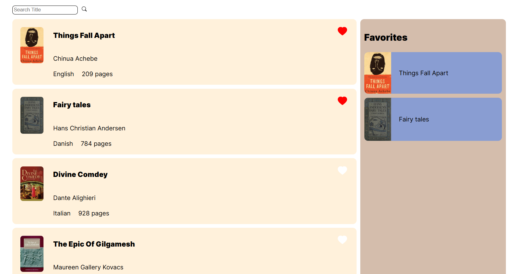
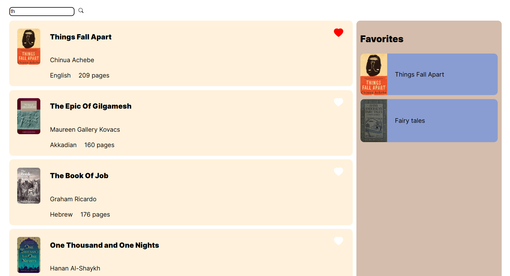

# Books Project 📚

Welcome to **Books Project**, a modern and responsive web application built with React and Vite to showcase and manage a collection of books. This project provides a clean and intuitive interface for book enthusiasts to browse, explore, or organize their favorite books, all without relying on external APIs.

## Table of Contents
- [About the Project](#about-the-project)
- [Features](#features)
- [Technologies Used](#technologies-used)
- [Screenshots](#screenshots)
- [Installation](#installation)
- [Usage](#usage)
- [Contributing](#contributing)
- [License](#license)
- [Contact](#contact)

## About the Project
Books Project is a React-based web application designed to help users browse or manage a curated collection of books. With a focus on simplicity and performance, it offers a seamless experience for exploring book details like titles, authors, and genres, all powered by a lightweight Vite setup.

### Why This Project?
- Showcases modern React development with Vite for fast builds and hot module replacement (HMR).
- Provides a clean and user-friendly interface for book lovers.
- Open-source and ready for contributions to add new features or improvements.

## Features
- 📖 Browse a collection of books with details like title, author, and description.
- 🔍 Filter or search books by title, author, or genre (if implemented).
- 📱 Responsive design for seamless use on desktop and mobile devices.
- ⭐ Simple and intuitive UI for exploring books.
- 📚 Optional book management features (e.g., adding to a reading list, if implemented).

## Technologies Used
- **React**: ^18.x.x for building the user interface.
- **Vite**: ^5.x.x for fast development and bundling.
- **JavaScript**: Core language (81.0% of the codebase) for logic and functionality.
- **CSS**: Styling the application (15.6% of the codebase).
- **HTML**: Structure of the app (3.4% of the codebase).
- **ESLint**: For maintaining code quality.
- **Git & GitHub**: Version control and repository hosting.

## Screenshots
Explore the Books Project through these snapshots:

| Homepage | Book List | Book Details |
|----------|-----------|--------------|
|  |  |  |

<!-- Replace screenshot1.png, screenshot2.png, etc., with your actual screenshot file names -->

## Installation
Follow these steps to set up the project locally:

1. **Clone the repository**:
   ```bash
   git clone https://github.com/NahidKameli/Books.git
   cd Books
